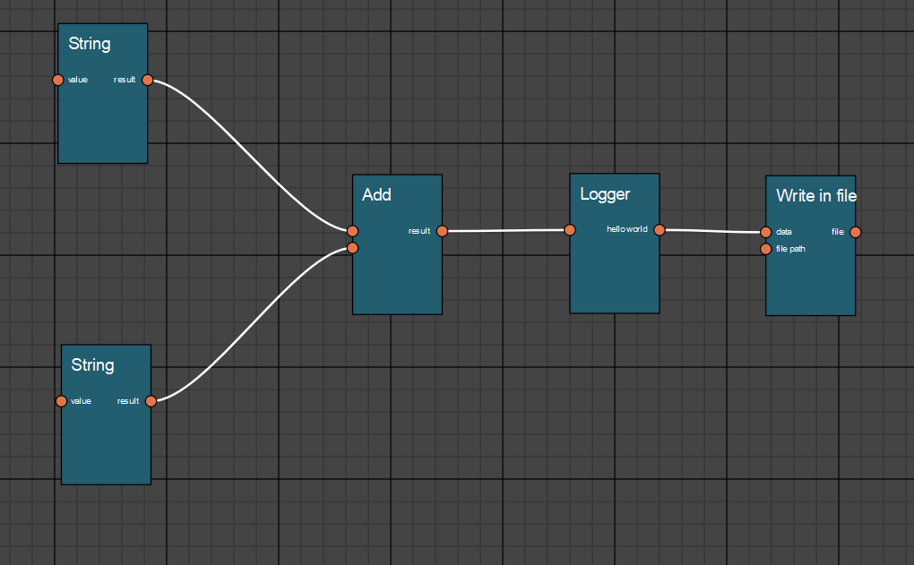

# Graph Editor

The purpose of this library is to provide a versatile graph editor.

The graph editor ak 'Node Editor' is based on graph theory where objects are represented by Nodes and their relations by Edges.
This kind of User interface is highly used in Digital Content Creation softwares.

This library try to provide a simple agnostic graph model interface, with some default implementations.
Core library is designed to facilitate injection of custom implementations.
In this version core and view are not yet bound together.

The view logic is decoupled (not yet totally) from the graphical library. 

main.py launch a PyQt implementation


### Note for Valentin and Thomas.
This release is not an attempt to have a full featured Graph Editor.
It has been done from scratch, working in my spare time, only few hours. It's an attempt to show the kind of code 
and software design I can provide quickly.
Don't hesitate if you have any questions.

Thanks.

*nicolas.lambert.3d@gmail.com*


## Release 0.0.1




## Features

The editor is in **very early stage**. It can only draw nodes with attributes and their connections.
User interactions are limited to span/ zoom and moving the nodes.


- PyQt GraphEditor Widget
  - Pan / Zoom in the view
  - Nodes with attributes
  - Edges
  - Editor events are delegated to Tools


## Installation

```
pipenv install
```

## Running the example

```
pipenv shell
python main.py
```

## Running the tests

Test are written in a Behavior development style.
They only cover the core graph for now.

Starting to decouple the view logic from the graphic library in order to facilitate view testing.

```
pytest -v  tests/step_defs/test_dag_def.py
```

## Generate the doc *(Actually not working correctly)*

Please remarks, right now the doc is not working

```
cd docs && make html
```